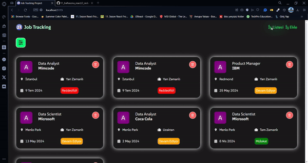

# İş Takip Uygulaması

Bu proje, işlerinizi takip etmek ve yönetmek için geliştirilmiş bir iş takip uygulamasıdır. Uygulama, iş ekleme, durum kontrolü ve filtreleme özellikleri sunmaktadır.

## Özellikler

- **İş Ekleme:** Yeni işler ekleyebilirsiniz.
- **Durum Kontrolü:** Her bir işin durumunu değiştirebilir (örneğin: mülakatta, reddedildi, devam ediyor) ve güncelleyebilirsiniz.
- **Filtreleme:** İşleri arama ve sıralama seçenekleriyle (A-Z ve Z-A) filtreleyebilirsiniz.

## Ekran Görüntüleri




## Teknolojiler

- **React:** Uygulama için temel kütüphane.
- **Vite:** Hızlı geliştirme süreci için kullanıldı.
- **json-server:** Yerel API olarak kullanıldı.
- **Axios:** API istekleri için kullanıldı.
- **React Redux ve Redux Toolkit:** Durum yönetimi için kullanıldı.
- **SCSS:** Stiling için tercih edildi.
- **Toastify:** Bildirimler için kullanıldı.
- **React Icons:** İkonlar için kullanıldı.

## Kurulum

Projenizi yerel ortamınızda çalıştırmak için aşağıdaki adımları izleyin:

1. **Depoyu klonlayın:**
   ```bash
   git clone https://github.com/cengo14/react-redux-job-tracking-project
   ```
   
2. **Proje dizinine gidin:**
   ```bash
   cd react-redux-job-tracking-project
   ```
   
3. **Gerekli paketleri yükleyin:**
   ```bash
   npm install
   ```

4. **json-server'ı başlatın:**
   ```bash
   npm run server
   ```

5. **Uygulamayı başlatın:**
   ```bash
   npm run dev
   ```

## Kullanım

- Uygulama açıldığında, iş eklemek için ilgili alanları doldurun.
- Eklediğiniz işleri görüntüleyebilir ve durumlarını güncelleyebilirsiniz.
- İşleri aramak veya sıralamak için filtreleme seçeneklerini kullanın.


